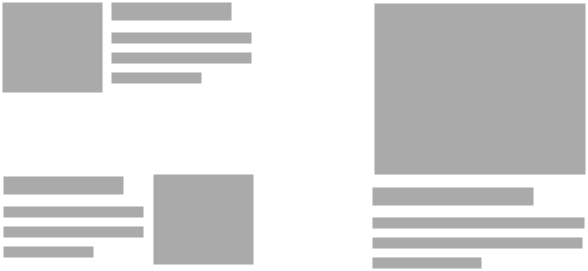
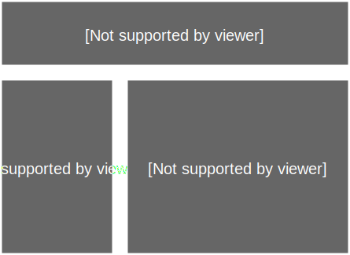

title: 编写可维护的 CSS
theme: material

---

# 编写可维护的 CSS

---

## 目的

* 提供一致、合理的开发基础
* 应对变化
* 提升效率

---

<<+++++++
页 → 站
+>>

---

## 文件结构

```
css
|
|-- base
|   |-- normalize.css
|   |-- mixins.css
|   |-- layout.css
|   `-- variables.css
|
|-- modules
|   |-- button.css
|   |-- checkbox.css
|   |-- dialog.css
|   |-- form.css
|   |-- input.css
|   |-- modal.css
|   |-- pagination.css
|   |-- radio.css
|   |-- select.css
|   |-- tab.css
|   |-- table.css
|   |-- textarea.css
|   `-- tip.css
|
`-- pages
    |-- index.css
    |-- page-a.css
    |-- page-b.css
    `-- page-c.css
```

---

## CSS Reset & normalize.css

---

## CSS reset

* 设置 HTML 标签的默认样式
* 使其在各个浏览器表现*基本一致*
* 让默认样式*归零*

---

```css
html {
  -ms-text-size-adjust: 100%;
  -webkit-text-size-adjust: 100%;
}
body {
  margin: 0;
  font: 16px/1.5 sans-serif;
  -moz-osx-font-smoothing: grayscale;
  -webkit-font-smoothing: antialiased;
}
h1,
h2,
h3,
h4,
p,
blockquote,
figure,
ol,
ul {
  margin: 0;
  padding: 0;
}
main,
li {
  display: block;
}
h1,
h2,
h3,
h4,
h5,
h6 {
  font-size: inherit;
}
strong {
  font-weight: bold;
}
a,
button {
  color: inherit;
  transition: .3s;
}
a {
  text-decoration: none;
}
button {
  overflow: visible;
  border: 0;
  font: inherit;
  -webkit-font-smoothing: inherit;
  letter-spacing: inherit;
  background: none;
  cursor: pointer;
}
::-moz-focus-inner {
  padding: 0;
  border: 0;
}
:focus {
  outline: 0;
}
img {
  max-width: 100%;
  height: auto;
  border: 0;
}
```

---

## normalize.css

* 设置 HTML 标签的默认样式
* 使其在各个浏览器表现*基本一致*
* 保留标签的默认样式

---

<<--

```css
/*! normalize.css v5.0.0 | MIT License | github.com/necolas/normalize.css */

/* Document
   ========================================================================== */

/**
 * 1. Change the default font family in all browsers (opinionated).
 * 2. Correct the line height in all browsers.
 * 3. Prevent adjustments of font size after orientation changes in
 *    IE on Windows Phone and in iOS.
 */

html {
  font-family: sans-serif; /* 1 */
  line-height: 1.15; /* 2 */
  -ms-text-size-adjust: 100%; /* 3 */
  -webkit-text-size-adjust: 100%; /* 3 */
}

/* Sections
   ========================================================================== */

/**
 * Remove the margin in all browsers (opinionated).
 */

body {
  margin: 0;
}

/**
 * Add the correct display in IE 9-.
 */

article,
aside,
footer,
header,
nav,
section {
  display: block;
}

/**
 * Correct the font size and margin on `h1` elements within `section` and
 * `article` contexts in Chrome, Firefox, and Safari.
 */

h1 {
  font-size: 2em;
  margin: 0.67em 0;
}

/* Grouping content
   ========================================================================== */

/**
 * Add the correct display in IE 9-.
 * 1. Add the correct display in IE.
 */

figcaption,
figure,
main { /* 1 */
  display: block;
}

/**
 * Add the correct margin in IE 8.
 */

figure {
  margin: 1em 40px;
}

/**
 * 1. Add the correct box sizing in Firefox.
 * 2. Show the overflow in Edge and IE.
 */

hr {
  box-sizing: content-box; /* 1 */
  height: 0; /* 1 */
  overflow: visible; /* 2 */
}

/**
 * 1. Correct the inheritance and scaling of font size in all browsers.
 * 2. Correct the odd `em` font sizing in all browsers.
 */

pre {
  font-family: monospace, monospace; /* 1 */
  font-size: 1em; /* 2 */
}

/* Text-level semantics
   ========================================================================== */

/**
 * 1. Remove the gray background on active links in IE 10.
 * 2. Remove gaps in links underline in iOS 8+ and Safari 8+.
 */

a {
  background-color: transparent; /* 1 */
  -webkit-text-decoration-skip: objects; /* 2 */
}

/**
 * Remove the outline on focused links when they are also active or hovered
 * in all browsers (opinionated).
 */

a:active,
a:hover {
  outline-width: 0;
}

/**
 * 1. Remove the bottom border in Firefox 39-.
 * 2. Add the correct text decoration in Chrome, Edge, IE, Opera, and Safari.
 */

abbr[title] {
  border-bottom: none; /* 1 */
  text-decoration: underline; /* 2 */
  text-decoration: underline dotted; /* 2 */
}

/**
 * Prevent the duplicate application of `bolder` by the next rule in Safari 6.
 */

b,
strong {
  font-weight: inherit;
}

/**
 * Add the correct font weight in Chrome, Edge, and Safari.
 */

b,
strong {
  font-weight: bolder;
}

/**
 * 1. Correct the inheritance and scaling of font size in all browsers.
 * 2. Correct the odd `em` font sizing in all browsers.
 */

code,
kbd,
samp {
  font-family: monospace, monospace; /* 1 */
  font-size: 1em; /* 2 */
}

/**
 * Add the correct font style in Android 4.3-.
 */

dfn {
  font-style: italic;
}

/**
 * Add the correct background and color in IE 9-.
 */

mark {
  background-color: #ff0;
  color: #000;
}

/**
 * Add the correct font size in all browsers.
 */

small {
  font-size: 80%;
}

/**
 * Prevent `sub` and `sup` elements from affecting the line height in
 * all browsers.
 */

sub,
sup {
  font-size: 75%;
  line-height: 0;
  position: relative;
  vertical-align: baseline;
}

sub {
  bottom: -0.25em;
}

sup {
  top: -0.5em;
}

/* Embedded content
   ========================================================================== */

/**
 * Add the correct display in IE 9-.
 */

audio,
video {
  display: inline-block;
}

/**
 * Add the correct display in iOS 4-7.
 */

audio:not([controls]) {
  display: none;
  height: 0;
}

/**
 * Remove the border on images inside links in IE 10-.
 */

img {
  border-style: none;
}

/**
 * Hide the overflow in IE.
 */

svg:not(:root) {
  overflow: hidden;
}

/* Forms
   ========================================================================== */

/**
 * 1. Change the font styles in all browsers (opinionated).
 * 2. Remove the margin in Firefox and Safari.
 */

button,
input,
optgroup,
select,
textarea {
  font-family: sans-serif; /* 1 */
  font-size: 100%; /* 1 */
  line-height: 1.15; /* 1 */
  margin: 0; /* 2 */
}

/**
 * Show the overflow in IE.
 * 1. Show the overflow in Edge.
 */

button,
input { /* 1 */
  overflow: visible;
}

/**
 * Remove the inheritance of text transform in Edge, Firefox, and IE.
 * 1. Remove the inheritance of text transform in Firefox.
 */

button,
select { /* 1 */
  text-transform: none;
}

/**
 * 1. Prevent a WebKit bug where (2) destroys native `audio` and `video`
 *    controls in Android 4.
 * 2. Correct the inability to style clickable types in iOS and Safari.
 */

button,
html [type="button"], /* 1 */
[type="reset"],
[type="submit"] {
  -webkit-appearance: button; /* 2 */
}

/**
 * Remove the inner border and padding in Firefox.
 */

button::-moz-focus-inner,
[type="button"]::-moz-focus-inner,
[type="reset"]::-moz-focus-inner,
[type="submit"]::-moz-focus-inner {
  border-style: none;
  padding: 0;
}

/**
 * Restore the focus styles unset by the previous rule.
 */

button:-moz-focusring,
[type="button"]:-moz-focusring,
[type="reset"]:-moz-focusring,
[type="submit"]:-moz-focusring {
  outline: 1px dotted ButtonText;
}

/**
 * Change the border, margin, and padding in all browsers (opinionated).
 */

fieldset {
  border: 1px solid #c0c0c0;
  margin: 0 2px;
  padding: 0.35em 0.625em 0.75em;
}

/**
 * 1. Correct the text wrapping in Edge and IE.
 * 2. Correct the color inheritance from `fieldset` elements in IE.
 * 3. Remove the padding so developers are not caught out when they zero out
 *    `fieldset` elements in all browsers.
 */

legend {
  box-sizing: border-box; /* 1 */
  color: inherit; /* 2 */
  display: table; /* 1 */
  max-width: 100%; /* 1 */
  padding: 0; /* 3 */
  white-space: normal; /* 1 */
}

/**
 * 1. Add the correct display in IE 9-.
 * 2. Add the correct vertical alignment in Chrome, Firefox, and Opera.
 */

progress {
  display: inline-block; /* 1 */
  vertical-align: baseline; /* 2 */
}

/**
 * Remove the default vertical scrollbar in IE.
 */

textarea {
  overflow: auto;
}

/**
 * 1. Add the correct box sizing in IE 10-.
 * 2. Remove the padding in IE 10-.
 */

[type="checkbox"],
[type="radio"] {
  box-sizing: border-box; /* 1 */
  padding: 0; /* 2 */
}

/**
 * Correct the cursor style of increment and decrement buttons in Chrome.
 */

[type="number"]::-webkit-inner-spin-button,
[type="number"]::-webkit-outer-spin-button {
  height: auto;
}

/**
 * 1. Correct the odd appearance in Chrome and Safari.
 * 2. Correct the outline style in Safari.
 */

[type="search"] {
  -webkit-appearance: textfield; /* 1 */
  outline-offset: -2px; /* 2 */
}

/**
 * Remove the inner padding and cancel buttons in Chrome and Safari on macOS.
 */

[type="search"]::-webkit-search-cancel-button,
[type="search"]::-webkit-search-decoration {
  -webkit-appearance: none;
}

/**
 * 1. Correct the inability to style clickable types in iOS and Safari.
 * 2. Change font properties to `inherit` in Safari.
 */

::-webkit-file-upload-button {
  -webkit-appearance: button; /* 1 */
  font: inherit; /* 2 */
}

/* Interactive
   ========================================================================== */

/*
 * Add the correct display in IE 9-.
 * 1. Add the correct display in Edge, IE, and Firefox.
 */

details, /* 1 */
menu {
  display: block;
}

/*
 * Add the correct display in all browsers.
 */

summary {
  display: list-item;
}

/* Scripting
   ========================================================================== */

/**
 * Add the correct display in IE 9-.
 */

canvas {
  display: inline-block;
}

/**
 * Add the correct display in IE.
 */

template {
  display: none;
}

/* Hidden
   ========================================================================== */

/**
 * Add the correct display in IE 10-.
 */

[hidden] {
  display: none;
}
```

->>

---

## CSS 模块

* 可复用的 CSS 代码段
* 与模块在 HTML 中的位置无关
* (一般)与使用的 HTML 标签无关

---

```markup
<style>
  .btn {
    display: inline-block;
    padding: 0.36em 0.8em;
    margin-right: 0.5em;
    border: none;
    border-radius: 0.3em;
    cursor: pointer;
  }
</style>

<form>
  <button class="btn">提交</button>
</form>

<p>
  <input class="btn" type="button" value="取消">
</p>
```

---

## CSS 模块原则

* 面向对象 (OOCSS)
* 单一职责原则（SRP）
* 开闭原则
* Don't Repeat Yourself（DRY）

---

## 面向对象 (OOCSS)

```markup
<style>
  a {
    color: inherit;
    text-decoration: none;
  }
  .btn {
    display: inline-block;
    padding: 0.36em 0.8em;
    margin-right: 0.5em;
    border: none;
    border-radius: 0.3em;
    cursor: pointer;
  }
  .btn--primary {
    background-color: #09c;
    color: #fff;
  }
</style>

<form>
  <button class="btn btn--primary">提交</button>
  <button class="btn">重置</button>
</form>
```

---

## OOCSS 原则

* 结构和皮肤分离
  * `.btn .btn--primary .btn--info .btn--danger`

* 容器和内容分离
  ```css
  /* 不推荐这样写！ */
  .header .btn {
    background: #f66;
    color: #fff;
  }
  ```

---

## Media Object



---

## 结构

```markup
<div class="media media--left">
  <a class="media__image">
    
  </a>
  <div class="media__body">
    <h3 class="media__title">Title</h3>
    <p class="media__description">
      A paragraph about the media
    </p>
  </div>
</div>
```

---

```pug
.media
    .media__image
        .media__object
    .media__body
        .media__title
        .media__description
```

---

## CSS

```css
.media,
.media__body {
  overflow:hidden;
}
.media__body :first-child {
  margin-top: 0;
}

.media--left .media__image {
  float:left;
  margin-right: 1em;
}

.media--right .media__image {
  float:right;
  margin-left: 1em;
}
```

---

## 单一职责原则（SRP）

* 尽可能细地拆分成*可独立复用*的组件
* 通过组合方式使用多个组件
* 比如将布局和其它样式拆分

---

```css
.error-message {
  display: block;
  padding: 10px;
  border-top: 1px solid #f00;
  border-bottom: 1px solid #f00;
  background-color: #fee;
  color: #f00;
  font-weight: bold;
}

.success-message {
  display: block;
  padding: 10px;
  border-top: 1px solid #0f0;
  border-bottom: 1px solid #0f0;
  background-color: #efe;
  color: #0f0;
  font-weight: bold;
}
```

---

```css
.box {
  display: block;
  padding: 10px;
}

.message {
  border-style: solid;
  border-width: 1px 0;
  font-weight: bold;
}

.message--error {
  background-color: #fee;
  color: #f00;
}

.message--success {
  background-color: #efe;
  color: #0f0;
}
```

---

## 开闭原则

* 对扩展开放
* 对修改关闭

---

```css
.box {
  display: block;
  padding: 10px;
}

/* bad example */
.content .box {
  padding: 20px;
}

/* better example */
.box--large {
  padding: 20px;
}
```

---

## Don't Repeat Yourself（DRY）

```css
/* bad example */
.selector {
  border-top: 1px solid #fcc;
  border-left: 1px solid #fcc;
  border-bottom: 1px solid #fcc;
}


/* better example */
.selector {
  border: 1px solid #fcc;
  border-right: none;
}
```

---

```css
/* bad example */
.icon-1 {
  background: url(img.png) no-repeat 0 0;
}
.icon-2 {
  background: url(img.png) no-repeat 0 -100px;
}


/* better example */
.icon-1, .icon-2 {
  background: url(img.png) no-repeat 0 0;
}
.icon-2 {
  background-position-y: -100px;
}
```

---

## 命名 Naming

* 基于功能
  * 它是用来干什么的？
  * `.button/.form/.list/.external-link/.tab-item/.nav`
* 基于内容
  * 元素里面放的是什么内容？
  * `.news/.user-info/.help/.contact-me`
* 基于视觉
  * 看起来是什么样？
  * `.round-image/.nowrap`

---

## 命名原则

* 优先使用基于功能的命名
  * 样式与内容无关
* 中小型网站可以基于内容去命名
* 大型网站可以使用基于视觉去命名
  * 不要使用太具体的样式

---



---


---


---

## 功能 vs 视觉 vs 具体样式

`.warning vs .orange`

`.btn-primary vs .btn-blue`

`.size-large vs .width-200`

`.form-inline`

`.nav-stacked`

---

## CSS 命名规范

---

## BEM

* Block
* Element
* Modifier

---

```markup
<nav>
  <a href="#">Home</a>
  <a href="#">JavaScript</a>
  <a href="#">CSS</a>
</nav>
```

---

## Block（Module / Component）

```markup
<nav class="tabs">
  <a href="#">Home</a>
  <a href="#">JavaScript</a>
  <a href="#">CSS</a>
</nav>
```

---

## Element（Block 内的元素）

```markup
<nav class="tabs">
  <a class="tabs__item" href="#">Home</a>
  <a class="tabs__item" href="#">JavaScript</a>
  <a class="tabs__item" href="#">CSS</a>
</nav>
```

---

## Modifier（修饰）

```markup
<nav class="tabs tabs--stacked">
  <a class="tabs__item" href="#">Home</a>
  <a class="tabs__item" href="#">JavaScript</a>
  <a class="tabs__item" href="#">CSS</a>
</nav>
```

---

## Modifier（修饰）

```markup
<nav class="tabs tabs--stacked">
  <a class="tabs__item--active" href="#">Home</a>
  <a class="tabs__item" href="#">JavaScript</a>
  <a class="tabs__item" href="#">CSS</a>
</nav>
```

---

# `.block__element--modifier`

---

## 编写简洁易维护的 CSS

---

## CSS 预处理

* [less](http://lesscss.org/)
* [Sass](http://sass-lang.com/)
* [Stylus](http://stylus-lang.com/)
* [PostCSS](http://postcss.org/)

---

iframe(src="http://cssnext.io/playground/" fullscreen)

---

## CSS 变量

```markup
<h1>页面标题</h1>

<style>
:root {
  --primary-color: #f66;
  --heading-font: Helvetica, "Microsoft Yahei", Sans-Serif;
}

h1, h2, h3 {
  font-family: var(--heading-font);
  color: var(--primary-color);
}
.btn--primary {
  background: var(--primary-color);
}
</style>
```

---

## Nesting 嵌套

```markup
<nav class="navbar">
  <a class="navbar__item">Home</a>
  <a class="navbar__item">CSS</a>
  <a class="navbar__item">JavaScript</a>
</nav>

<style>
  .navbar {
    display: table;
    width: 100%;
    background: #f66;

    & .navbar__item {
      display: table-cell;
      color: #fff;
    }
  }
</style>
```

---

## Mixins

```css
:root {
  --h-center {
    margin-left: auto;
    margin-right: auto;
  }
}
.main {
  @apply --h-center;
  max-width: 100em;
  min-width: 40em;

}
```

---

## 颜色相关函数

```css
:root {
  --primary-color: #f66;
}
.btn {
  background: var(--primary-color);
  &:hover {
    background: color(var(--primary-color) blackness(20%));
  }
}

---

## import

```css
/* app.css */
@import 'variables.css';
@import 'common.css';
@import 'modules/button.css';
@import 'modules/form.css';
```

---

## Plugins

* AutoPrefixer
* StyleLint

---


bgcolor: green

<<+++++++++ :fa-comments: +>>

---

## 总结

* 形成规范
  * 文件组织、代码风格、命名规范
* 工具
  * 预处理器、lint
* 积累沉淀

---

## 持续学习

* [CSS-Tricks](https://css-tricks.com/)
* [Smashing Magazine](https://www.smashingmagazine.com/)   

---


