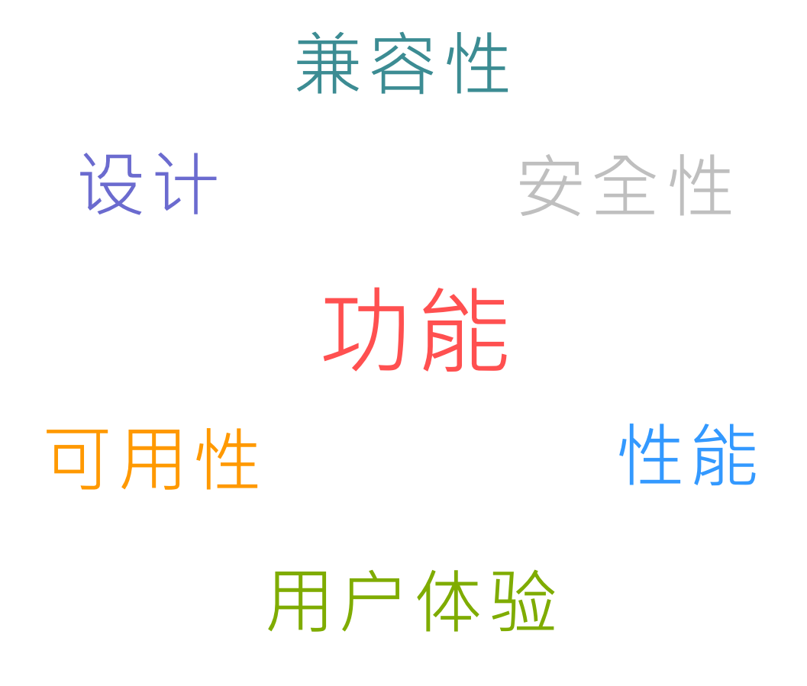
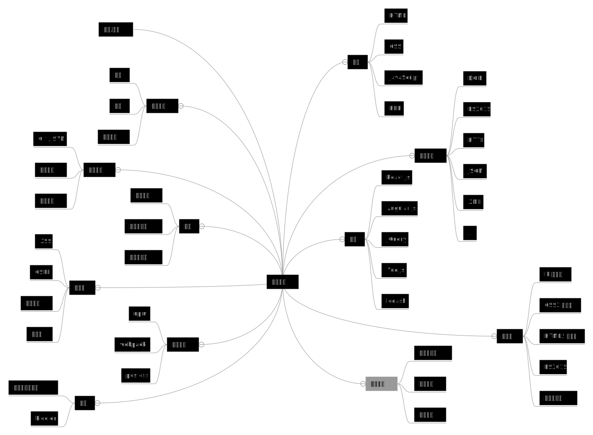

title: Getting Started
theme: material
transition: slide

---

# 前端概览
### 赵文博
#### 2016-12-03

---

## 赵文博

* 360 奇舞团技术经理
* 从 IE6 时代走过来的前端工程师

---

## 目录

* 前端是什么？
* 课程安排
* 准备知识

---

## Web 前端开发

* 使用 Web 标准技术（HTML、CSS、JavaScript、SVG、HTTP 等）
* 开发网页或 Web 应用
* 通常运行在浏览器
* 可交互

---

---

fragment: true

  
内容 （HTML）

  
外观 （CSS）

  
交互 （JavaScript）

---

---

bgcolor: #000

---

# 关于课程

---

fragment: true

## 基础与细节

* React 已经玩儿得很 6 了，还有必要从 HTML 开始学吗？
* 我以后只想写 JavaScript，还有必要学 CSS 吗？
* 这些属性、API 什么的，用的时候查手册就行，有必要背会吗？

---

## 课程形式

* 教学
* 扩展阅读(10+篇)
* 作业

---

# 准备知识

---

## 浏览器

<<++++++

:fa-chrome:
:fa-firefox:
:fa-safari:
:fa-opera:
:fa-internet-explorer:
:fa-edge:

+>>

---

---

| 浏览器 | 渲染引擎 | JavaScript 引擎 |
|--------|---------|--------------|
| :fa-internet-explorer: Internet Explorer | Trident | JScript |
| :fa-edge: Edge | EdgeHTML | Chakra |
| :fa-safari: Safari | [Webkit](https://webkit.org/) | Nitro |
| :fa-chrome: Chrome | [Blink](https://www.chromium.org/blink) | [V8](https://developers.google.com/v8/) |
| :fa-firefox: Firefox | Gecko | SpiderMonkey |
| :fa-opera: Opera | Presto → Blink | Carakan →  V8 |

---

## 壳浏览器

* 360 浏览器
* UC 浏览器
* QQ 浏览器
* 搜狗浏览器

---

## URL (Universal Resource Locator)

## &nbsp;

PORT

---

## 编辑器

* [Atom](https://atom.io/)
* [Visual Studio Code](https://code.visualstudio.com/)
* [Vim](http://www.vim.org/)
* [Sublime Text](https://www.sublimetext.com/)

---

<<+++++++++ :fa-comments: +>>

