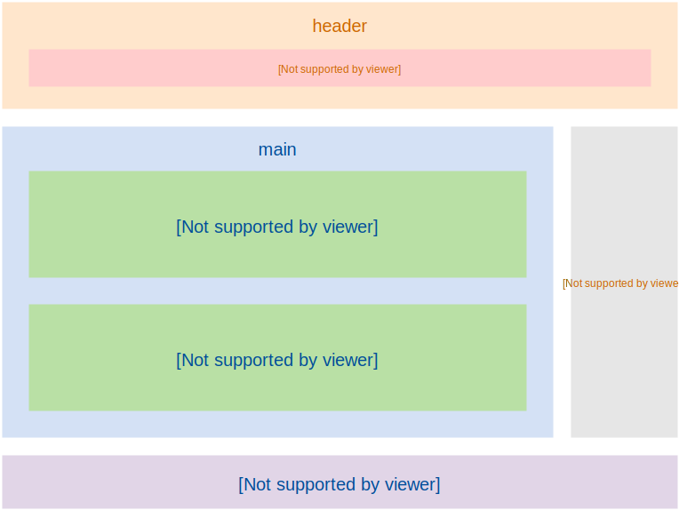

title: HTML introlduction and text
theme: material
transition: slide

---

# HTML：简介、文本

---

```markup
<!doctype html>
<html>
    <head>
        <meta charset="UTF-8">
        <title>页面标题</title>
    </head>
    <body>
        <h1>这是内容</h1>
    </body>
</html>
```

---

## HTML 是什么？

* HyperText Markup Language
* 使用 *标签* 来描述页面的 *内容* 和 *结构*

---

## HTML 的产生

* 1989 年, Tim Berners-Lee
* 共享文档需要
* 还发明了浏览器、服务器和 HTTP

---

## HTML 1.0, 1991

```
TITLE NEXTID A ISINDEX PLAINTEXT

P H1 H2 H3 H4 H5 H6 ADDRESS

DL DT DD UL LI
```

---

### HTML 2.0, 1994, IETF

```
<!DOCTYPE html PUBLIC "-//IETF//DTD HTML 2.0//EN">

HTML HEAD BODY H1 H2 H3 H4 H5 H6

P PRE XMP LISTING ADDRESS BLOCKQUOTE

UL OL LI DIR MENU DL DT DD 

EM STRONG B I CITE CODE DFN KBD

SAMP VAR STRIKE U TT BR IMG

FORM INPUT SELECT OPTION TEXTAREA
```

---

## HTML 3.2, 1997, W3C

* Netscape 引入私有标签
* HTML 3.0 失败
* W3C 接管 HTML 标准化

---

## HTML 4.01, 1998

* 样式与内容分离，CSS 支持
* Doctype

---

## Doctype 的作用

* 指定HTML页面使用的标准和版本
* 浏览器根据doctype决定使用哪种渲染模式

---

## 渲染模式

* Quirks Mode 怪异模式
* Almost Standard Mode 准标准模式
* Standard Mode 标准模式

---

```
<!DOCTYPE html>

<!DOCTYPE HTML PUBLIC "-//W3C//DTD HTML 4.01//EN"
  "http://www.w3.org/TR/html4/strict.dtd">

<!DOCTYPE HTML PUBLIC "-//W3C//DTD HTML 4.01 Transitional//EN"
  "http://www.w3.org/TR/html4/loose.dtd">
```

---

## XHTML 1.0, 2000

* 用 XML 语法重新定义 HTML
* 语法严格要求

---

## XHTML 2.0

* 不兼容历史
* 去除样式类标签
* 去除 `img`、`a`
* 彻底修改 Form
* 开发者不欢迎，浏览器不支持

---

## HTML 5

* 2004年，WHATWG 继续发展 HTML
* 2008年，W3C HTML5 草案发布

---

## HTML5 设计思想

* 兼容已有内容
* 避免不必要的复杂性
* 解决现实的问题
* 优雅降级
* 尊重事实标准
* 用户 》开发者 》浏览器厂商 》标准制定者 》理论完美

---

## HTML5 中的变化

* `doctype`、`meta`
* 新增语义化标签和属性
* 去掉纯展示性标签
* `canvas`、`video`、`audio`、离线、本地存储、拖拽等

---

## 语法

* 标签不区分大小写，推荐小写
* 空标签可以不闭合，比如 `input`、`meta`
* 属性不必引号，推荐双引号
* 某些属性值可以省略，比如 `required`、`readonly`

---

<object data="slides/section-1/img/element.svg" height="360" width="1000"></object>

---

# HTML 中的文本标签

---

## `p`

```markup
<p>At the first World Wide Web conference organized by CERN 
in May 1994, all was merry with 380 attendees - who mostly
were from Europe but also included many from the United
States. </p>

<p>The conference ended with a glorious evening cruise on
board a paddle steamer around Lake Geneva with Wolfgang and
the Werewolves providing Jazz accompaniment.
```

---

## h1 ~ h6

```markup
<h1>Typography</h1>
<h2>History</h2>
<p>Although typically applied to printed, published, broadcast,
and reproduced materials in contemporary times, all words,
letters, symbols, and numbers written alongside the earliest
naturalistic drawings by humans may be called typography.</p>
<h3>Evolution</h3>
<p>The design of typefaces has developed alongside the
development of typesetting systems.</p>
<h2>Scope</h2>
```

---

## hr 段落级别的话题切换

```markup
<h3>Principles of the typographic craft</h3>
<p>Much of the legibility research literature is somewhat
atheoretical—various factors were tested individually or
in combination (inevitably so, as the different factors are
interdependent), but many tests were carried out in the
absence of a model of reading or visual perception.</p>
<hr>
<p>Type may be combined with negative space and images,
forming relationships and dialog between the words and
images for special effects. Display designs are a potent
element in graphic design. </p>
```

---

## 列表

* 有序列表
* 无序列表
* 定义列表

---

## 有序列表

```markup
<h1>世界电影票房排行榜</h1>
<ol start="1">
  <li>阿凡达</li>
  <li>泰坦尼克号</li>
  <li>复仇者联盟</li>
</ol>
```

---

## 无序列表

```markup
<h1>购物清单</h1>
<ul>
  <li>1个西瓜</li>
  <li>2瓶矿泉水</li>
  <li>1盒酸奶</li>
</ul>
```

---

```markup
<ul>
  <li>1个西瓜</li>
  <li>2瓶矿泉水</li>
  <li>1盒酸奶</li>
  <li>
    垃圾袋
    <ul>
      <li>大号垃圾袋</li>
      <li>小号垃圾袋</li>
    </ul>
  </li>
</ul>
```

---

## 定义列表

```markup
<h3>霸王别姬</h3>
<dl>
  <dt>导演：</dt>
  <dd>陈凯歌</dd>
  <dt>主演：</dt>
  <dd>张国荣</dd>
  <dd>张丰毅</dd>
  <dd>巩俐</dd>
  <dt>上映日期：</dt>
  <dd>1993-01-01</dd>
</dl>
```

---

## 嵌套规则

```markup
<div>
  <li>Item 1</li>
  <li>Item 2</li>
</div>
<span>
  <dt>专业：</dt>
  <dd>软件工程</dd>
</span>
```

---

### 引用

```markup
<blockquote cite="http://t.cn/RfjKO0F">
  <p>天才并不是自生自长在深林荒野里的怪物， 是由可以使天才生长
  的民众产生、长育出来的，所以没有 这种民众，就没有天才。</p>
</blockquote>
<p>--鲁迅</p>

<p>我最喜欢的一本书是<cite>小王子</cite>。</p>

<p>在<cite>第一章</cite>，我们讲过<q>字符串是不可变量</q>。</p>
```

---

## 预格式化文本

```markup
<p>第一行 空    格
第二行</p>

<pre>第一行 空    格
第二行</pre>
```

---

## 代码

```markup
<p><code>const</code>声明创建一个只读的常量。</p>

<pre><code>
const add = (a, b) => a + b;
const multiply = (a, b) => a * b;
</code></pre>
```

---

## figure

```markup
<figure>
  
  <figcaption>威廉·卡斯隆制作的一张字体排印样表</figcaption>
</figure>

<figure>
  <figcaption>定义一个函数</figcaption>
  <pre><code>
  function add(x, y) {
    var total = x + y;
    return total;
  }
  </code></pre>
</figure>
```

---

## 网页总体结构



---

## 内容划分

```markup
<article>
  <header>
    <h1>字体排印学</h1>
    <p>作者：XXX</p>
  </header>
  <section>
    <h2>语源及其范围</h2>
    <p>在当代，字体排印学的相关研究和实践范围相当广...</p>
    <p>以字体排印为核心的图像中，通常使用四项基本手...</p>
  </section>
  <section>
    <h2>可读性和易读性</h2>
    <p>可读性和易读性经常被混淆。可读性通常用...</p>
    <p>与之相对，易读性描述的是排印文本阅读时的...</p>
  </section>
  <footer>
    <h2>参考链接</h2>
    <nav>
      <ul>
        <li><a href="">衬线字体</a></li>
        <li><a href="">字体设计</a></li>
      </ul>
    </nav>
  </footer>
</article>
```

---

## 我该用哪个标签？

iframe(src="slides/section-1/img/h5d-sectioning-flowchart.pdf" width="1000" height="770")

---

## 强调

* `strong`：重要性、严重性和紧急性
* `em`：从一句话中突出某个词语
* `b`：将词语从视觉上和其它部分区分，比如一篇论文摘要中的关键词
* `i`：换一种语调去说一句话时，比如其它语言翻译，对话中的旁白

---

## 定义与缩写

```markup
<p><dfn>HTML是HyperText Markup Language的简称，一种用户创建
网页的标记语言</dfn></p>

<p><abbr title="HyperText Markup Language">HTML</abbr>
标准由<abbr title="World Wide Web Consortium">W3C<abbr>
制定和修改。</p>
```

---

## 代码

```markup
<p>使用HTML5写页面，第一行要写<code>&lt;!DOCTYPE html&gt;</code></p>

<p>能量<var>E</var>等于质量<var>m</var>乘以光速<var>c</var>的平方</p>

<p>按下<kbd>F12</kbd>打开浏览器开发者工具。</p>

<p>检查当前工作仓库状态：</p>
<pre><code>zhaowenbo@localhost:camp$ <kbd>git status</kbd>
<samp>On branch master
Your branch is up-to-date with 'origin/master'.
</samp>
</code></pre>
```

---

## 上标和下标

```markup
<p>E = MC<sup>2</sup></p>
<p>CO<sub>2</sub></p>
```
---

## mark

* 和用户当前行为相关的突出，比如在搜索结果中匹配到的词
* 一部分内容需要在后面引用时

---

## 插入和删除

```markup
<p>但是，该属性<del>目前还没有浏览器支持。</del>
<ins>更新：最新版本的Safari 6.1已经支持。</ins></p>

<p><del>原价：299元</del> <ins>双11特价：188元</ins></p>
```

---

## 换行控制(尽量避免)

```markup
<p>JavaScript<br>高级程序设计</p>

<p>https://zh.wikipedia.org/wiki/%E4%B8%87%E7%BB%B4%E7%BD%91%E8%81%94%E7%9B%9F</p>

<p>https://zh.wikipedia.org/<wbr>wiki/<wbr>%E4%B8%87%E7%BB%B4<wbr>%E7%BD%91%E8%81%94%E7%9B%9F</p>
```

---

## div 和 span

实在找不到其它更符合语义的标签时使用

---

## 实体(Entity)字符

```markup
&amp; &nbsp; &lt; &gt; &copy; &yen; &#9775;
```

---

bgcolor: green

<<+++++++++ :fa-comments: +>>


