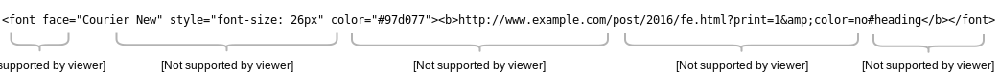

title: HTML Links and Images
theme: material
transition: slide

---

# HTML：链接

---

```markup
<a href="http://www.w3.org">W3C</a>
```

---

## 链接地址



---

## 省略协议

```markup
<a href="//p0.ssl.qhimg.com/t01b8873158fcb3981a.png">查看图片</a>
```

---

## 省略协议 和 host

```markup
<a href="/index.html">返回首页</a>
```

---

## 相对路径与绝对路径

```markup
<a href="/a/b/c.html">绝对路径</a>
<a href="a/b/c.html">相对路径</a>
<a href="../../c.html">相对路径</a>
```

---

## 页面内链接（锚点）

```markup
<h1>锚点</h1>
<p><a href="#test">到test</a></p>
<p>0</p> <p>0</p> <p>0</p>
<p>0</p> <p>0</p> <p>0</p>
<p>0</p> <p>0</p> <p>0</p>
<p>0</p> <p>0</p> <p>0</p>
<p>0</p> <p>0</p> <p>0</p>
<p>0</p> <p>0</p> <p>0</p>
<p>0</p> <p>0</p> <p>0</p>
<p>0</p> <p>0</p> <p>0</p>
<p>0</p> <p>0</p> <p>0</p>
<p id="test">test</p>
<p><a href="#">回顶部</a></p>
<p>0</p> <p>0</p> <p>0</p>
<p>0</p> <p>0</p> <p>0</p>
<p>0</p> <p>0</p> <p>0</p>
<p>0</p> <p>0</p> <p>0</p>
<p>0</p> <p>0</p> <p>0</p>
<p>0</p> <p>0</p> <p>0</p>
<p>0</p> <p>0</p> <p>0</p>
<p>0</p> <p>0</p> <p>0</p>
<p>0</p> <p>0</p> <p>0</p>
```

---

## 链接目标

```markup
<a href="http://www.w3.org" target="_self">W3C（当前窗口）</a>
<a href="http://www.w3.org" target="_blank">W3C（新窗口）</a>
<a href="http://www.w3.org" target="abc">W3C（abc）</a>
<a href="http://www.example.com" target="abc">Example（abc）</a>
```

---

# HTML: 图片

```markup


<figure>
    
    <figcaption>图片说明</figcaption>
</figure>
```
---

## 指定图片宽高

* 不指定高宽：原图大小显示
* 指定宽度：按比例缩放到指定宽度
* 指定高度：按比例缩放到指定高度
* 指定高宽：强制按指定宽高显示

---

### 常用图片格式

* jpg

    * 照片
* png

    * 色彩较少时使用
    * png24可以半透明
* gif

    * 无法半透明
    * 可以多帧做动画
* webp

---

bgcolor: green

<<+++++++++ :fa-comments: +>>


