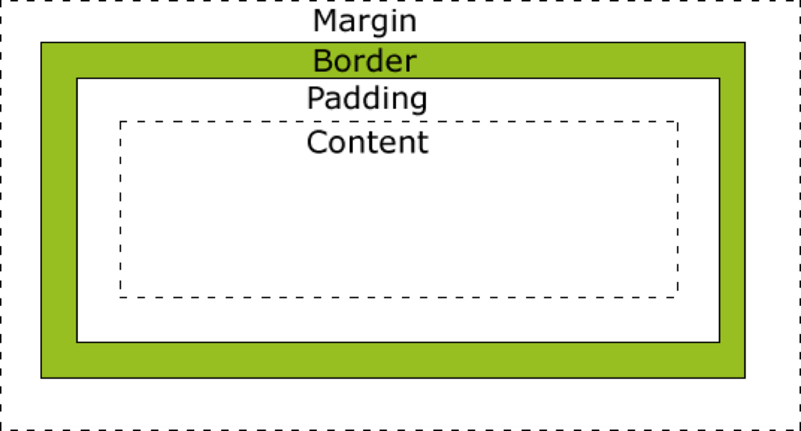

title: Box Model
transition: slide

---

# Box Model

---


## 盒模型基础

---

## box model



---

## width

* 指定 `content box` 宽度
* 百分数相对于父容器（包含块）的 `content box` 宽度

---

## height

* 指定 `content box` 高度
* 百分数相对于父容器（包含块）的 `content box` 高度
* 只有当包含块的高度不依赖该元素时，百分比高度才生效

---

```markup
<div class="container">
  <div class="child">属性具有重叠的功能，指定规则的顺序很重要</div>
</div>

<style>
  body {
    margin: 0;
  }
  .container {
    background: lightblue;
    height: 100vh;
  }
  .child {
    height: 100%;
    background: coral;
  }
</style>
```

---

## `padding`

* 内边距
* `padding-top、padding-right、padding-bottom、padding-left`
* 缩写：`padding`

---

```markup
<div class="box1"><p>Box 1: 10px</p></div>
<div class="box2"><p>Box 2: 10px 20px 30px 40px</p></div>
<div class="box3"><p>Box 3: 10px 20px</p></div>

<style>
  .box1 {
    padding: 10px;
    background: lightblue;
  }
  .box2 {
    padding: 10px 20px 30px 40px;
    background: coral;
  }
  .box3 {
    padding: 10px 20px;
    background: lightpink;
  }
  p {
    background: #fff;
    margin: 0;
  }
</style>
```

---

## margin

* 外边距
* margin-top、margin-right、margin-bottom、margin-left
* 缩写：margin

---

```markup
<div class="container">
  属性具有重叠的功能，指定规则的顺序很重要
</div>

<style>
  body {
    margin: 0;
  }
  .container {
    background: lightblue;
    margin: 1em;
    padding: 1em;
  }
</style>

---

```markup
<div class="a"></div>
<div class="b"></div>

<style>
  .a{
    background: lightblue;
    height: 100px;
    margin-bottom: 100px;
  }
  .b {
    background: coral;
    height: 100px;
    margin-top: 100px;
  }
</style>
```

---

## margin折叠

---

## margin可以为负值吗？

---

## box-sizing

* 改变盒模型计算方式
* 取值：`border-box | content-box`
* 初始值：`content-box`

---

```markup
<div class="box a">Box A</div>
<div class="box b">Box B</div>

<style>
  .box {
    width: 100px;
    height: 100px;
    padding: 10px;
    border: 10px solid #f66;
    background: #f99;
    margin: 1em;
  }
  .b {
    box-sizing: border-box;
  }
</style>
```

---

## border

* 边框的三个要素
  * `border-width: <length> | thin | medium | thick`
  * `border-style: none | solid | dashed | dotted | double`
  * `border-color: <color>`

* 四个方向
  * `border-left`
  * `border-top`
  * `border-right`
  * `border-bottom`

---

```markup
<p>冬季期间，大多数爬行动物和许多小型啮齿类动物
和各种昆虫进入冬眠的无效状态。然而，冬季是公园
里鸟类最集中的时节，因为许多 种候鸟的出现。</p>

<style>
  p {
    border-width: 2px;
    border-style: dashed;
    border-color: coral;
    line-height: 1.5;
    padding: 1em;
  }
</style>
```

---

## 不同的写法

```css
border-width: 1px 2px;
border-left-width: 3px;
border-left: 1px solid #ccc;
border: 1px solid #ccc;
```

---

## 当四条边框颜色不同时

```markup
<div class="box"></div>

<style>
  .box {
    border-width: 50px;
    border-style: solid;
    border-color: #f35 #269 #649 #fa0;

    width: 200px;
    height: 200px;
    transition: all 2s ease-in;
    margin: 1em auto;
  }
</style>


<script>
document.querySelector('.box').
  addEventListener('click', function(e){
  if (e.target.shrinked) {
    e.target.style.borderColor = 
    '#f35 transparent transparent transparent';
    return;
  }
  e.target.style.width = 0;
  e.target.style.height = 0;
  e.target.shrinked = true;
});
</script>
```

---

## min-width & max-width

```markup
<article>
  <h1>地理和植物生态</h1>
  <p>莫哈韦沙漠不仅纬度较高，而且温度要稍微低些，是命名该公园
  的短叶丝兰——约书亚树的特殊栖息地。约书亚树以从茂密的森林到
  远远间隔的实例等各种形式出现。除了约书亚树森林之外，该公园的
  西部包括加州沙漠里发现的最有趣的地质外观。</p>
  <p>这片景观的主要特征是裸露的岩石丘陵，通常会有松散的巨砾突
  然出现。这些丘陵在攀岩运动和攀援运动的热心人士之间广受欢迎。
  这些岩石丘陵间的平地上稀稀疏疏地林立着约书亚树。这些约书亚树
  还与巨砾堆和大岩石在一起使得这片景观超越了现实一样。</p>
</article>

<style>
  article {
    line-height: 1.7;
    max-width: 40em;
    min-width: 20em;
    font-family: serif;
  }
</style>
```

---

## min-height & max-height

```markup
<article>
  <h1>地理和植物生态</h1>
  <p>莫哈韦沙漠不仅纬度较高，而且温度要稍微低些，是命名该公园
  的短叶丝兰——约书亚树的特殊栖息地。约书亚树以从茂密的森林到
  远远间隔的实例等各种形式出现。除了约书亚树森林之外，该公园的
  西部包括加州沙漠里发现的最有趣的地质外观。</p>
  <p>这片景观的主要特征是裸露的岩石丘陵，通常会有松散的巨砾突
  然出现。这些丘陵在攀岩运动和攀援运动的热心人士之间广受欢迎。
  这些岩石丘陵间的平地上稀稀疏疏地林立着约书亚树。这些约书亚树
  还与巨砾堆和大岩石在一起使得这片景观超越了现实一样。</p>
</article>

<style>
  article {
    line-height: 1.7;
    max-width: 40em;
    min-width: 20em;
    max-height: 10em;
    font-family: serif;
  }
</style>
```

---

## overflow

* 溢出控制
* 取值：`visible | hidden | scroll | auto`
* 初始值：`visible`

---

```markup
<article>
  <h1>地理和植物生态</h1>
  <p>莫哈韦沙漠不仅纬度较高，而且温度要稍微低些，是命名该公园
  的短叶丝兰——约书亚树的特殊栖息地。约书亚树以从茂密的森林到
  远远间隔的实例等各种形式出现。除了约书亚树森林之外，该公园的
  西部包括加州沙漠里发现的最有趣的地质外观。</p>
  <p>这片景观的主要特征是裸露的岩石丘陵，通常会有松散的巨砾突
  然出现。这些丘陵在攀岩运动和攀援运动的热心人士之间广受欢迎。
  这些岩石丘陵间的平地上稀稀疏疏地林立着约书亚树。这些约书亚树
  还与巨砾堆和大岩石在一起使得这片景观超越了现实一样。</p>
</article>

<style>
  article {
    line-height: 1.7;
    max-width: 40em;
    min-width: 20em;
    max-height: 10em;
    font-family: serif;
    overflow: hidden;
  }
</style>
```

---

## 视觉格式化模型

浏览器是怎么排版的？

---

## 先来了解几个概念

---

## 视口（Viewport）

* 浏览器的可视区域
* 用户通过视口查看网页内容（透过窗户看风景）

---

## 块级*元素*(Block-level Elements)

* 会被格式化成块状的元素
* 例如 `p、div、section` 等
* 将 `display` 设置为 `block、list-item、table` 使元素变为块级

---

## 行级元素(Inline-level Elements)

* 不会为其内容生成块级框
* 让其内容分布在多行中
* `display` 设置为 `inline、inline-block、inline-table` 使元素变为行级

---

## 行级 vs 块级

```markup
<p><span>Learn to Code HTML & CSS is a simple and comprehensive
guide dedicated to helping beginners learn HTML and CSS.
Outlining the fundamentals, this guide works through all common
elements of front-end design and development.</span></p>

<style>
  p {
    line-height: 2;
    padding: 1em;
    border: 2px solid #00f;
    background: #ccf;
  }
  span {
    background: #fcc;
    border: 2px solid #f00;
  }
</style>
```

---

## 盒子的生成

* 每个块级元素生成一个主块级盒(principal block-level box)，用它来包含子级盒
* 每个行级元素生成一个行级盒，行级盒分布于多行

---

## Box Model - revisited

* `margin`：行级盒的 `margin-top` 和 `margin-bottom` 不会产生效果
* `padding`：行级盒的 `padding-top` 和 `padding-top` 不影响行布局

---

```markup
<p><span>Learn to Code HTML & CSS is a simple and comprehensive
guide dedicated to helping beginners learn HTML and CSS.
Outlining the fundamentals, this guide works through all common
elements of front-end design and development.</span></p>

<style>
  p {
    line-height: 2;
    padding: 1em;
    border: 2px solid #00f;
    background: #ccf;
  }
  span {
    background: #fcc;
    border: 2px solid #f00;
    padding-top: 1px;
    margin-top: 1px;
  }
</style>
```

---

fragment: true

## 块级盒子中的子盒子的生成

* 块级盒子中可以包含多个子块级盒子
* 也可以包含多个行级盒子
* 不在行级元素里面的文字，会生成匿名行级盒。比如 `<p>Some <em>Text</em></p>`
* 块级盒子中不能同时包含块级和行级盒子。遇到这种情况时，会生成匿名块级盒来包含行级盒。比如 `<div><h1>标题</h1><span>2016-12-12</span></div>`

---

## 行级盒子内的子盒子的生成

* 行级盒子内可以包含行级盒子
* 行级盒子包含一个块级盒子时，会被块级盒子拆成两个个行级盒子，这两个盒子又分别被匿名块级盒包含

---

## display属性

* `block` 生成块级盒
* `inline` 生成行级盒
* `inline-block` 生成行级盒，为其内容生成块级盒
* `none` 在排版时将元素忽略

---

## visibility

* 控制元素展示
* 取值：`visible | hidden | collapse`
* 初始值为 `visible`

---

```markup
<p>1</p>
<h1 class="heading1">你看不见我</h1>
<p>2</p>
<h1 class="heading2">你也看不见我</h1>
<p>3</p>

<style>
  .heading1 {
    visibility: hidden;
  }
  .heading2 {
    display: none;
  }
</style>
```

---

## Generated Content

* 控制元素
* `::before` 和 `::after`
* `content`

---

```markup
<a href="http://example.com">访问链接</a>

<style>
  a::before {
    content: '\2693'
  }
  a::after {
    content: '(' attr(href) ')';
  }
</style>
```

---

bgcolor: green

<<+++++++++ :fa-comments: +>>


