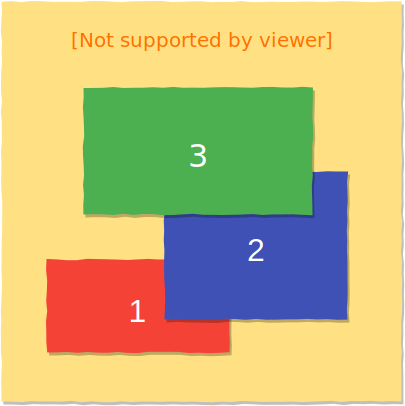
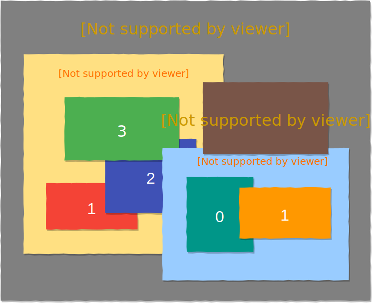

title: 定位和堆叠上下文
transition: slide

---

# 定位和堆叠

---

## 定位模式(Positioning schemes)

* 常规流(Normal Flow)
* 浮动(Float)
* 绝对定位(Absolute Positioning)

---

## position

* static，非定位，默认值
* relative，相对定位（相对自己）
* absolute，绝对定位，相对非 static 祖先元素定位
* fixed，相对于视口绝对定位

---

## relative

* 在常规流里面布局
* 相对于自己本应该在的位置进行偏移
* 使用 `top、left、bottom、right` 设置偏移长度
* 流内其它元素当它没有偏移一样布局

---

```markup
<figure>
  
  <figcaption>图片标题</figcaption>
</figure>
<p>其它文本内容。</p>

<style>
  figure {
    width: 512px;
  }
  figure img {
    display: block;
  }
  figcaption {
    position: relative;
    top: -28px;
    background: rgba(0,0,0,0.3);
    color: #fff;
    font-size: 14px;
    line-height: 2;
    padding: 0 1em;
  }
</style>
```

---

## absolute

* 脱离正常流
* 相对于最近的非 `static` 祖先的 padding box 定位
* 不会对流内元素布局造成影响
* 可以有 `margin`，但不会折叠

---

```markup
<figure>
  
  <figcaption>图片标题</figcaption>
</figure>

<style>
  figure {
    width: 512px;
    position: relative;
  }
  figure img {
    display: block;
  }
  figcaption {
    position: absolute;
    bottom: 0;
    width: 100%;
    background: rgba(0,0,0,0.3);
    color: #fff;
    font-size: 14px;
    line-height: 2;
    padding: 0 1em;
  }
</style>
```

---

## 自动计算

* 这些值都可以不指定

    * top
    * left
    * right
    * bottom
    * width
    * height

* 如果冲突了怎么办?

---

```markup
<p>Enter your email below to get exclusive access to
our best articles and tips before everybody else.</p>
<div class="box">
  绝对定位内容。
</div>
<p>Just look at the image at the top of this article
to see how it will all work. Yes, you can install VLC
or another piece of Windows software that easily!
After you run the command, OneGet will locate the
package in your configured package sources, download
it to your computer, and install it — all
automatically.</p>

<style>
.box {
  position: absolute;
  background: #f00;
  color: #fff;
}
</style>
```

---

## `position:fixed`

* 相对于 `Viewport` 定位
* 不会随页面滚动发生位置变化

---

```markup
<nav>
  <a href="#">首页</a>
  <a href="#">导航1</a>
  <a href="#">导航2</a>
</nav>
<main>
  <section>1</section>
  <section>2</section>
  <section>3</section>
  <section>4</section>
  <section>5</section>
</main>
<a href="#" class="go-top">返回顶部</a>

<style>
  nav {
    position: fixed;
    line-height: 2;
    background: rgba(0,0,0,0.3);
    width: 100%;
  }
  nav a {
    padding: 0 1em;
    color: rgba(255,255,255,0.7);
  }
  nav a:hover {
    color: #fff;
  }
  .go-top {
    position: fixed;
    right: 1em;
    bottom: 1em;
    color: #fff;
  }
  body {
    margin: 0;
    font-size: 14px;
  }
  a {
    color: #fff;
    text-decoration: none;
  }
  section {
    height: 66.6667vh;
    color: #fff;
    text-align: center;
    font-size: 5em;
    line-height: 66vh;
  }
  section:nth-child(1) {
    background: #F44336;
  }
  section:nth-child(2) {
    background: #3F51B5;
  }
  section:nth-child(3) {
    background: #FFC107;
  }
  section:nth-child(4) {
    background: #607D8B;
  }
  section:nth-child(5) {
    background: #4CAF50;
  }
</style>
```

---

## z-index 堆叠层次

* 为定位元素指定其在 z 轴的上下等级
* 用一个整数表示，数值越大，越靠近用户
* 初始值为 auto，可以为负数、0、正数

---

```markup
<div class="box-a">Box a</div>
<div class="box-b">Box b</div>
<div class="box-c">Box c</div>

<style>
  [class^="box-"] {
    position: absolute;
    width: 200px;
    line-height: 200px;
    text-align: center;
    color: #fff;
  }
  .box-a {
    background: #F44336;
  }
  .box-b {
    top: 100px;
    left: 100px;
    z-index: -1;
    background: #0097A7;
  }
  .box-c {
    top: 150px;
    left: 150px;
    z-index: 1;
    background: #4CAF50;
  }
</style>
```

---

## `z-index` 大的一定在上面吗？

---

```markup
<nav>
  <ul>
    <li>菜单1</li>
    <li>菜单2</li>
  </ul>
</nav>

<div id="dialog">
  dialog content
</div>

<style>
  nav {
    position: fixed;
    top: 0;
  }
  nav ul {
   position: absolute;
    z-index: 2;
    top: 0;
    left: 0;
    background: red;
    padding: 1em;
    width: 10em;
  }
  #dialog {
    position: absolute;
    z-index: 1;
    top: 5em;
    left: 5em;
    background: blue;
    height: 10em;
    width: 10em;
  }

  body {
    color: #fff;
  }
  li {
    margin: 1em 0;
    list-style:none;
  }
  #dialog {
    padding: 1em;
  }
  ul {
    padding: 1em;
  }
</style>
```

---

## 堆叠上下文



---



---

## 堆叠上下文的生成

* Root 元素
* `z-index` 值不为 `auto` 的定位元素
* 设置了某些 CSS3 属性的元素，比如 `opacity`、  
  `transform`、`animation` 等

---

### 绘制顺序

* 在每一个堆叠上下文中，从下到上：

  * 形成该上下文的元素的 `border` 和 `background`
  * `z-index` 为负值的子堆叠上下文
  * 常规流内的块级元素非浮动子元素
  * 非定位的浮动元素
  * 常规流内非定位行级元素
  * `z-index` 为 `0` 的子元素或子堆叠上下文
  * `z-index` 为正数的子堆叠上下文

---


bgcolor: green

<<+++++++++ :fa-comments: +>>


