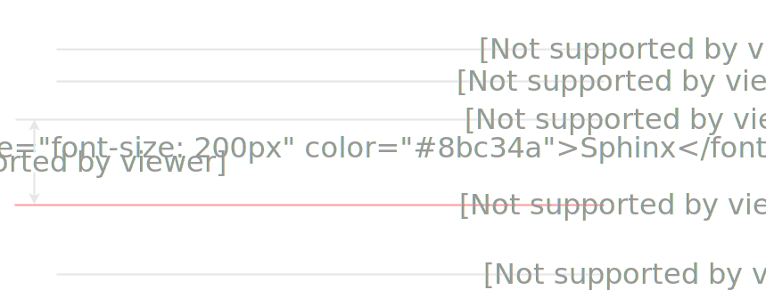
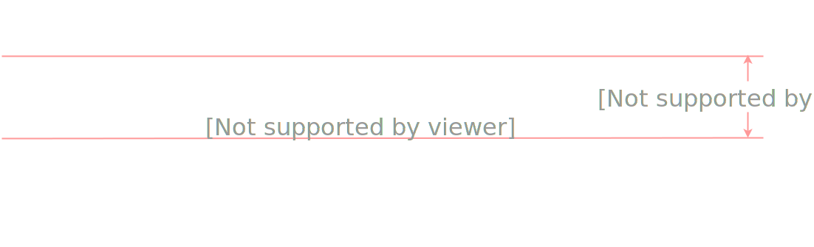
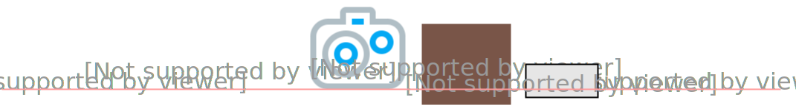
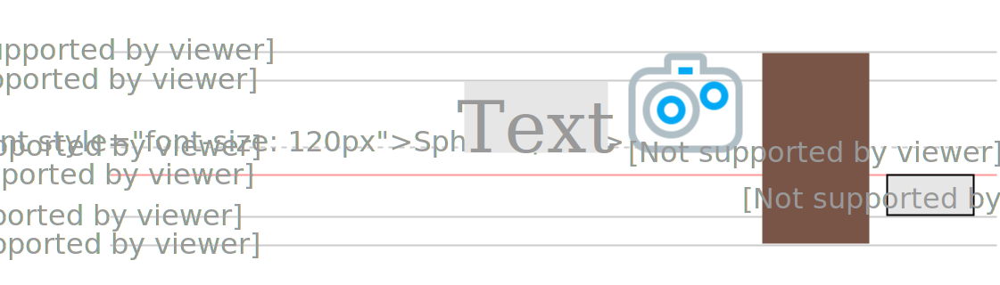

title: 视觉格式化细节
transition: slide

---

# CSS details

---

## 行级格式化上下文

Inline Formatting Context

---

## Font Metrics



---

## line-height



---

## line box 内的盒子摆放



---

## vertical-align

* 定义盒子所处的行盒(line box)的垂直对齐关系
* 取值：`baseline | sub | super | top | text-top | middle | bottom | text-bottom | <percentage> | <length>`
* 百分比相对于元素自身的行高
* 初始值 baseline

---



---

## top & text-top

```markup
<p><span>
  Rapidly advancing technology revolutionized <em>typography</em>
  in the latter twentieth century.
</span></p>

<style>
  span {
    line-height: 5;
    background: coral;
  }
  em {
    vertical-align: text-top;
    display: inline-block;
    background: lightblue;
    line-height: 1.5;
    font-size: 200%;
  }
</style>
```

---

## strut

```markup
<p></p>

<style>
  p {
    padding: 0;
    background: red;
  }
</style>
```

---

## lists style

* `display: list-item` 会生成 Principle Block Box 和 Marker Box
* Marker Box 的内容和位置可以通过 `list-style` 系列属性指定

---

## list-style-position

```markup
<h1>Typography</h1>
<ul>
  <li>Typography is the art and technique of arranging type
  to make written language legible, readable, and appealing
  when displayed.</li>
  <li>Rapidly advancing technology revolutionized typography
  in the latter twentieth century.</li>
</ul>

<style>
  li:first-child {
    list-style-position: inside;
  }
</style>
```

---

## list-style-type

* none
* disc
* circle
* square
* decimal
* lower-roman
* upper-roman
* lower-greek
* lower-latin
* upper-latin
* armenian
* georgian
* lower-alpha
* upper-alpha

---

```markup
<ul>
  <li>Typography is the art and technique of arranging type
  to make written language legible, readable, and appealing
  when displayed.</li>
  <li>Rapidly advancing technology revolutionized typography
  in the latter twentieth century.</li>
</ul>

<style>
  li:first-child {
    list-style-type: decimal;
  }
  li:last-child {
    list-style-type: lower-roman;
  }
</style>
```

---

## list-style-image

```markup
<ul>
  <li>Item 1</li>
  <li>Item 2</li>
  <li>Item 3</li>
</ul>

<style>
  li {
    list-style-image: 
      url(https://s5.ssl.qhres.com/static/81c9c4d9eb2f79ba.svg)
  }
</style>
```

---

## background

* background-color
* background-image
* background-repeat
* background-position
* background-attachment

---

```markup
<div>content</div>

<style>
div {
  width: 100px;
  height: 100px;
  background-color: red;
  background-image:
    url(https://s5.ssl.qhres.com/static/81c9c4d9eb2f79ba.svg);
  background-repeat: no-repeat;
  background-position: 0 0;
}
</style>
```

---

## background

```css
background: red url(path/to/img.png) no-repeat 0 0;
```

---

## CSS Sprites

```markup
<ul>
  <li class="item-1">Item 1</li>
  <li class="item-2">Item 2</li>
  <li class="item-3">Item 3</li>
</ul>

<style>
  ul {
    padding: 0;
  }
  li {
    display: block;
    background: url(//p1.ssl.qhimg.com/t0111e26ee101fb8ecb.gif)
      no-repeat 0 0;
    padding-left: 32px;
    line-height: 1.7;
    margin: 1em 0;
  }
  li.item-2 {
    background-position: 0 -50px;
  }
  li.item-3 {
    background-position: 0 -104px;
  }
</style>

---

## background-size

```markup
<div></div>

<style>
  div {
    border: 1px solid red;
    width: 200px;
    height: 100px;
    background: url(//p5.ssl.qhimg.com/t013753a42172e3170a.jpg)
      no-repeat 0 0;
    background-size: 200px 100px;
  }
</style>
```

---

## border-radius

* border-radius: 5px
* 可以指定四个方向
* 可以使用百分数

---

```markup
<div id="example-one">1</div>
<div id="example-two">2</div>
<div id="example-three">3</div>
<div id="example-four">4</div>
<div id="example-five">5</div>
<div id="example-six">6</div>
<div id="example-seven">7</div>

<style>
#example-one {
  border-radius: 10px;
}
#example-two {
  border-radius: 10px;
  border: 3px solid green;
}
#example-three {
  border-radius: 5px 20px;
}
#example-four {
  border-radius: 10px/30px; 
}
#example-five {
  border-radius: 30px/10px;
}
#example-six {
   border-radius: 50%;
}
#example-seven {
  width: 200px;
  border-radius: 50%;
}
#example-eight {
   width: 200px;
}
div {
  background: #BADA55;
  width: 100px;
  height: 100px;
  text-align: center;
  line-height: 100px;
  color: #000;
  font-size: 24px;
  font-family: Helvetica, sans-serif;
  float: left;
  margin: 1em
}
</style>
```

---

## box-shadow

iframe(src="http://www.box-shadow-generator.com/en/" fullscreen)

---

## multiple box shadow

iframe(src="http://www.box-shadow-generator.com/en/" fullscreen)

---

bgcolor: green

<<+++++++++ :fa-comments: +>>


