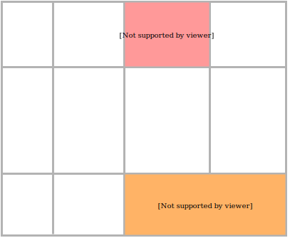

title: 布局
transition: slide

---

# 布局

---

## 布局方法

* float
* position
* inline-block
* table
* flex
* grid

---

## 居中

---

## 水平居中

* 行级元素：`text-align: center`
* 块级元素：`margin: auto`

---

```markup

<article>
  <h1>Colors and Backgrounds</h1>
  <p>CSS properties allow authors to specify the foreground
    color and background of an element. Backgrounds may be
    colors or images. Background properties allow authors to
    position a background image, repeat it, and declare
    whether it should be fixed with respect to the viewport
    or scrolled along with the document.</p>
</article>

<style>
  article {
    margin-left: auto;
    margin-right: auto;
    padding: 1em;
    background: lightblue;
    line-height: 1.8;
    max-width: 40em;
  }
  h1 {
    background: coral;
    text-align: center;
  }
</style>
```

---

## 垂直居中

* 单行文字：`line-height`
* 行级盒子：`vertical-align: middle`
* 绝对定位：`top: 50%; left: 50%`

---

```markup
<p>
  <em>共享</em> 未安装人群
</p>

<style>
  p {
    padding: 0 1em;
    background: #eee;
    line-height: 2;
    font-size: 16px;
  }
  em {
    font-size: 12px;
    background: #0c7cd5;
    display: inline-block;
    vertical-align: middle;
    line-height: 1.5;
    padding: 0 0.5em;
    font-style: normal;
    color: #fff;
  }
</style>
```

---

```markup
<div class="modal" role="dialog">
  <h3>出错啦！</h3>
  <p>服务器暂时无法处理您提交的数据，请稍后再试。</p>
  <div class="actions">
    <button>确定</button>
  </div>
</div>

<style>
  .modal {
    position: fixed;
    box-sizing: border-box;
    font-size: 14px;
    width: 20em;
    height: 10em;
    padding: 1em;
    top: 50%;
    left: 50%;
    margin-left: -10em;
    margin-top: -5em;
    border: 1px solid #ccc;
    box-shadow: 1px 1px 5px rgba(0,0,0,0.3);
  }
</style>

```

---

## float-based layout

```markup
<main>
  <aside>aside</aside>
  <article>The list properties describe basic visual formatting of lists:
    they allow style sheets to specify the marker type (image, glyph,
    or number), and the marker position with respect to the principal
    box (outside it or within it before content). 
  </article>
</main>

<style>
  aside {
    width: 10em;
    float: left;
    background: lightblue;
    min-height: 20em;
  }
  article {
    overflow: hidden;
    background: coral;
    min-height: 20em;
  }
</style>
```

---

```markup
<main>
  <article>The list properties describe basic visual formatting of lists:
    they allow style sheets to specify the marker type (image, glyph,
    or number), and the marker position with respect to the principal
    box (outside it or within it before content). 
  </article>
  <aside>aside</aside>
</main>

<style>
  main {
    font-size: 14px;
    padding-left: 10em;
  }
  article {
    float: left;
    width: 100%;
    background: coral;
    min-height: 20em;
  }
  aside {
    width: 10em;
    float: left;
    margin-left: -10em;
    position: relative;
    left: -100%;
    background: lightblue;
    min-height: 20em;
  }
</style>
```

---

## (伪)等高


```markup
<main>
  <article>The list properties describe basic visual formatting of lists:
    they allow style sheets to specify the marker type (image, glyph,
    or number), and the marker position with respect to the principal
    box (outside it or within it before content). 
  </article>
  <aside>aside</aside>
</main>

<style>
  main {
    font-size: 14px;
    padding-left: 10em;
    overflow: hidden;
  }
  article {
    float: left;
    width: 100%;
    background: coral;
    padding-bottom: 99em;
    margin-bottom: -99em;
  }
  aside {
    width: 10em;
    float: left;
    margin-left: -10em;
    position: relative;
    left: -100%;
    background: lightblue;
    padding-bottom: 99em;
    margin-bottom: -99em;
  }
</style>
```

---

## position

```markup
<main>
  <article>The list properties describe basic visual formatting of lists:
    they allow style sheets to specify the marker type (image, glyph,
    or number), and the marker position with respect to the principal
    box (outside it or within it before content). 
  </article>
  <aside>aside</aside>
</main>

<style>
  main {
    font-size: 14px;
    position: relative;
  }
  article {
    background: coral;
    margin-left: 10em;
  }
  aside {
    width: 10em;
    position: absolute;
    top: 0;
    left: 0;
    bottom: 0;
    background: lightblue;
  }
</style>

---

## table layout

```markup
<table>
  <thead>
    <tr>
      <th>浏览器</th>
      <th>JavaScript 引擎</th>
      <th>CSS 引擎</th>
    </tr>
  </thead>
  <tbody>
    <tr>
      <th>Chrome</th>
      <td>V8</td>
      <td>Blink</td>
    </tr>
    <tr>
      <th>Firefox</th>
      <td>SpiderMonkey</td>
      <td>Gecko</td>
    </tr>
    <tr>
      <th>Edge</th>
      <td>ChakraCore</td>
      <td>EdgeHTML</td>
    </tr>
  </tbody>
</table>

<style>
  table {
    width: 100%;
    border-collapse: collapse;
    font-size: 14px;
  }
  th, td {
    border: 1px solid #666;
    padding: 1em;
  }
  tr > :first-child {
    width: 8em;
  }
</style>
```

---

## fixed table layout

```markup
<table>
  <thead>
    <tr>
      <th>浏览器</th>
      <th>JavaScript 引擎</th>
      <th>CSS 引擎</th>
    </tr>
  </thead>
  <tbody>
    <tr>
      <th>Chrome</th>
      <td>V8</td>
      <td>Blink</td>
    </tr>
    <tr>
      <th>Firefox</th>
      <td>SpiderMonkey</td>
      <td>Gecko</td>
    </tr>
    <tr>
      <th>Edge</th>
      <td>ChakraCore</td>
      <td>EdgeHTML</td>
    </tr>
  </tbody>
</table>

<style>
  table {
    width: 100%;
    table-layout: fixed;
    border-collapse: collapse;
    font-size: 14px;
  }
  th, td {
    border: 1px solid #666;
    padding: 1em;
  }
  tr > th {
    width: 8em;
  }
</style>
```

---

## 不要使用表格*标签*布局！

---

## `display: table`

```css
display: table                /* <table>     */
display: table-cell           /* <td>        */
display: table-row            /* <tr>        */
display: table-column         /* <col>       */
display: table-column-group   /* <colgroup>  */
display: table-footer-group   /* <tfoot>     */
display: table-header-group   /* <thead>     */
```

---

```markup
<main>
  <article>The list properties describe basic visual formatting of lists:
    they allow style sheets to specify the marker type (image, glyph,
    or number), and the marker position with respect to the principal
    box (outside it or within it before content). 
  </article>
  <aside>aside</aside>
</main>
<style>
  main {
    display: table;
    width: 100%;
    font-size: 14px;
  }
  article, aside {
    display: table-cell;
    padding: 1em;
  }
  article {
    background: coral;
  }
  aside {
    width: 10em;
    background: lightblue;
  }
</style>
```

---

```markup
<nav>
  <a href="#">Home</a>
  <a href="#">HTML</a>
  <a href="#">CSS</a>
  <a href="#">JavaScript</a>
  <a href="#">HTTP</a>
</nav>

<style>
  nav {
    width: 100%;
    display: table;
    border-collapse: collapse;
    font-size: 14px;
    line-height: 3;
  }
  nav a {
    display: table-cell;
    text-align: center;
    border: 1px solid #fff;
    text-decoration: none;
    color: rgba(255, 255, 255, 0.8);
    background: hsl(181, 58%, 52%);
  }
  nav a:hover {
    color: #fff;
    background: hsl(181, 58%, 45%);
  }
</style>
```

---

```markup
<div class="container">
  
</div>

<style>
  .container {
    display: table-cell;
    text-align: center;
    vertical-align: middle;
    width: 400px;
    height: 400px;
    background: lightblue;
  }
</style>
```

---

## Flexbox

真正为解决布局问题而生的规范

---

Flexbox 可控制子元素：

* 水平或垂直排成一行
* 控制子元素对齐方式
* 控制子元素的宽度/高度
* 控制子元素显示顺序
* 控制子元素是否折行

---

## `display: flex`

* 将元素变为 Flexbox
* 子元素在容器内水平(默认)或垂直摆放

---

```markup
<ul>
  <li>Item 1</li>
  <li>Item 2</li>
  <li>Item 3</li>
</ul>

<style>
  ul {
    display: flex;
    padding: 0;
    background: lightgray;
  }
  li {
    list-style: none;
    padding: 1em;
    background: lightblue;
  }
</style>
```

---

## `flex-direction`

* 子元素排列方向
* 取值：`row | row-reverse | column | column-reverse`


---

```markup
<ul>
  <li>Item 1</li>
  <li>Item 2</li>
  <li>Item 3</li>
</ul>

<style>
  ul {
    display: flex;
    flex-direction: column-reverse;
    padding: 0;
    background: lightgray;
  }
  li {
    list-style: none;
    padding: 1em;
    background: lightblue;
  }
</style>
```

---



---



---

## `flex-grow`

* 定义每一个子元素在盒子内的弹性
* 拓展盒子剩余空间的能力
* 取值：<number>，默认 0

---

```markup
<ul>
  <li class="item-1">Item 1</li>
  <li class="item-2">Item 2</li>
  <li class="item-3">Item 3</li>
</ul>

<style>
  ul {
    display: flex;
    padding: 0;
    background: lightgray;
  }
  li {
    list-style: none;
    padding: 1em;
  }
  .item-1 {
    background: lightblue;
    flex-grow: 1;
  }
  .item-2 {
    background: lightgreen;
    flex-grow: 1;
  }
  .item-3 {
    background: coral;
  }
</style>
```

---

## `flex-shrink`

* 元素收缩的能力
* 取值：<number>，默认 1

---

```markup
<ul>
  <li class="item-1">Item 1 content</li>
  <li class="item-2">Item 2 content</li>
  <li class="item-3">Item 3 content</li>
</ul>

<style>
  ul {
    display: flex;
    padding: 0;
    background: lightgray;
  }
  li {
    list-style: none;
    padding: 1em;
  }
  .item-1 {
    background: lightblue;
    flex-grow: 1;
    flex-shrink: 0;
  }
  .item-2 {
    background: lightgreen;
    flex-grow: 1;
  }
  .item-3 {
    background: coral;
  }
</style>
```

---

## `flex-wrap`

* 元素在主轴方向排放时，能否换行
* 取值：`nowrap | wrap | wrap-reverse`


---

```markup
<ul>
  <li class="item-1">Item 1 content</li>
  <li class="item-2">Item 2 content</li>
  <li class="item-3">Item 3 content</li>
  <li class="item-4">Item 4 content</li>
</ul>

<style>
  ul {
    display: flex;
    flex-wrap: wrap;
    padding: 0;
    background: lightgray;
  }
  li {
    list-style: none;
    padding: 1em;
    width: 33%;
    box-sizing: border-box;
  }
</style>
```

---

## justify-content

* 子元素沿主轴方向的摆放
* 取值：`flex-start | flex-end | center | space-between | space-around`


---

```markup
<ul>
  <li class="item-1">Item 1 content</li>
  <li class="item-2">Item 2 content</li>
  <li class="item-3">Item 3 content</li>
</ul>

<style>
  ul {
    display: flex;
    justify-content: space-between;
    padding: 0;
    background: lightgray;
  }
  li {
    list-style: none;
    padding: 1em;
  }
  .item-1 {
    background: lightblue;
  }
  .item-2 {
    background: lightgreen;
  }
  .item-3 {
    background: coral;
  }
</style>
```

---

## `align-items`

* 在侧轴方向的对齐方式
* 取值：`flex-start | flex-end | center | baseline | stretch`
* 默认值：`stretch`


---

```markup
<ul>
  <li class="item-1">Item 1 content</li>
  <li class="item-2">Item 2 content</li>
  <li class="item-3">Item 3 content Item 3 content Item 3 content
    Item 3 content</li>
</ul>

<style>
  ul {
    display: flex;
    padding: 0;
    background: lightgray;
  }
  li {
    list-style: none;
    padding: 1em;
  }
  .item-1 {
    background: lightblue;
    flex-shrink: 0
  }
  .item-2 {
    background: lightgreen;
    flex-shrink: 0
  }
  .item-3 {
    background: coral;
  }
</style>
```

---

## `align-self`


```markup
<ul>
  <li class="item-1">Item 1 content</li>
  <li class="item-2">Item 2 content</li>
  <li class="item-3">Item 3 content Item 3 content Item 3 content
    Item 3 content</li>
</ul>

<style>
  ul {
    display: flex;
    padding: 0;
    background: lightgray;
    align-items: flex-start;
  }
  li {
    list-style: none;
    padding: 1em;
  }
  .item-1 {
    background: lightblue;
    flex-shrink: 0;
    align-self: flex-end;
  }
  .item-2 {
    background: lightgreen;
    flex-shrink: 0;
  }
  .item-3 {
    background: coral;
  }
</style>
```


---

## `align-content`

* *多行内容*在容器内侧轴方向的对齐
* 取值：`flex-start | flex-end | center | space-between | space-around | stretch`


---

## `order`

* 指定摆放时的顺序，从小到大
* 取值：<integer>，默认 0

----

```markup
<ul>
  <li class="item-1">Item 1</li>
  <li class="item-2">Item 2</li>
  <li class="item-3">Item 3</li>
</ul>

<style>
  ul {
    display: flex;
    padding: 0;
    background: lightgray;
  }
  li {
    list-style: none;
    padding: 1em;
  }
  .item-1 {
    background: lightblue;
  }
  .item-2 {
    background: lightgreen;
    order: 1;
  }
  .item-3 {
    background: coral;
  }
</style>
```

---

## Flexbox 语法变化

```css
.container {
  display: -webkit-box;
  display: -webkit-flex;
  display: flex;
  -webkit-box-direction: normal;
  -webkit-box-orient: horizontal;
  -webkit-flex-direction: row;
  flex-direction: row;
  -webkit-flex-wrap: nowrap;
  flex-wrap: nowrap;
  -webkit-box-pack: start;
  -webkit-justify-content: flex-start;
  justify-content: flex-start;
  -webkit-align-content: stretch;
  align-content: stretch;
}
```

---

## Grid



---

## 不同布局属性浏览器兼容性

|               | :fa-internet-explorer: | :fa-chrome:   | :fa-firefox:  |
|---------------|---------------------|------------|------------|
| float         | :fa-check:          | :fa-check: | :fa-check:
| position      | :fa-check:          | :fa-check: | :fa-check:
| inline-block  | :fa-check:          | :fa-check: | :fa-check:
| display:table | 8+                  | :fa-check: | :fa-check:
| border-box    | 8+                  | :fa-check: | :fa-check:
| flex box      | 10+                 | :fa-check: | :fa-check:
| grid          | 10+                 | 57+        | 52+

---

bgcolor: green

<<+++++++++ :fa-comments: +>>


